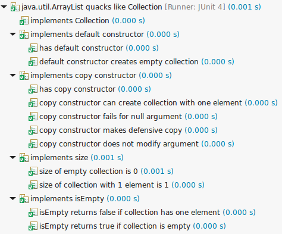

When you write a class that implements some popular contract, you face the boring task of writing same tests again and again. 
Quackery lets you write those tests once and reuse them.
It also has some built-in tests for well-known contracts, so you don't have to write those tests at all.

Running this example

    @RunWith(QuackeryRunner.class)
    public class JdkCollectionTest {
      @Quackery
      public static Test test() {
        return quacksLike(Collection.class).test(ArrayList.class);
      }
    }

with junit test runner produces something like this

See [tutorial](main/doc/tutorial.md) for all features.
