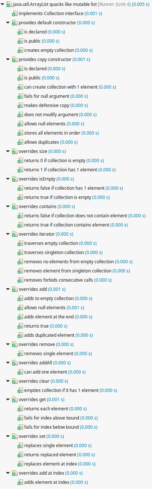

Having comprehensive collection of tests is something every TDD practitioner aims for.
But often writing tests gets tedious and we cut corners due to practical reasons.

 - Do you test all getters and setters of every bean?
 - Do you test `equals` and `hashCode` of every value object you write?
 - Do you test every corner case when implementing `List` or `Set`?

Quackery lets you write those tests once and reuse them in different contexts.

Reusable test can be something simple, like trivial assertion.

```
import static java.lang.String.format;
import static java.util.Arrays.asList;
import static org.quackery.Case.newCase;
import static org.quackery.Suite.suite;
import static org.quackery.report.AssertException.assertTrue;

import org.junit.runner.RunWith;
import org.quackery.Quackery;
import org.quackery.Test;
import org.quackery.junit.QuackeryRunner;

@RunWith(QuackeryRunner.class)
public class StringTest {
  @Quackery
  public static Test string_is_equal_to_itself() {
    return suite("string is equal to itself")
        .add(isEqualToItself("one"))
        .add(isEqualToItself("two"))
        .add("three", StringTest::isEqualToItself)
        .addAll(asList("four", "five", "six"), StringTest::isEqualToItself);
  }

  private static Test isEqualToItself(Object value) {
    return newCase(
        format("%s is equal to itself", value),
        () -> assertTrue(value.equals(value)));
  }
}
```


But it can be something big, like a customizable contract for testing whole class.
For example, quackery has built-in contract for testing that given `Class` implements `Collection` contract.

```
@RunWith(QuackeryRunner.class)
public class ArrayListTest {
  @Quackery
  public static Test test() {
    return quacksLike(Collection.class)
        .implementing(List.class)
        .test(ArrayList.class);
  }
}
```



See [documentation](main/doc/documentation.md) for all features.
