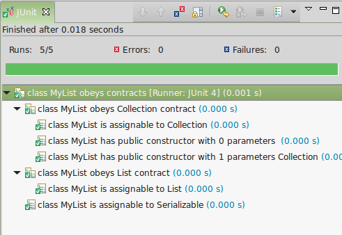

### Api overview
 - `org.testanza` package
   - `Test` - Interface for testing specific behavior for given item.
     - [`Case`](#tester-producing-case) - Subclass of `Test` that has name and invokable body.
     - [`Suite`](#tester-producing-suite) - Subclass of `Test` that has name and aggregates many tests.
   - [`Tester`](#why-use-testanza) - Interface for reusable part of `Test`.
   - [`Testers`](#testers) - Contains built-in factories of `Tester`.
   - [`TestBuilder`](#tester-producing-suite) - Utility for aggregating many `Test` to build `Suite`.
   - [`Junit`](#junit) - Converts testanza `Test` to `junit.framework.Test`
   - [`TestanzaAssertionError`](#asserting) - Subclass of `AssertionError`. It's thrown from any built-in `Tester`.
   - `TestanzaException` - Thrown in case of incorrect usage of testanza api.

### Why use Testanza?

Let's look at test asserting that `ArrayList` implements `Serializable` interface.

    @Test
    public void arrayListIsAssignableToSerializable() {
      assertTrue(Serializable.class.isAssignableFrom(ArrayList.class));
    }

To make this test more reusable, we could extract `type` as parameter.

    public void isAssignableToSerializable(Class<?> type) {
      assertTrue(Serializable.class.isAssignableFrom(type));
    }

To make test even more reusable, we could extract `superType` as parameter.

    public void isAssignableTo(Class<?> superType, Class<?> type) {
      assertTrue(superType.isAssignableFrom(type));
    }

In ideal world this would be enough.
We could use *currying* to create function for testing particular types.

    // hypothetical code
    isAssignableTo(Serializable.class)

And apply it to specific type.

    // hypothetical code
    isAssignableTo(Serializable.class)(ArrayList.class)

However Java has no *currying*, nor *first-class functions*.

To compensate for that Testanza provides `Tester` interface as intermediary.

    public interface Tester<T> {
      Test test(T item);
    }

Now you can implement it to define reusable part of our example `Test`.

    public static Tester<Class<?>> isAssignableTo(final Class<?> superType) {
      ...
    }

And apply specific argument to be tested.

    Test test = isAssignableTo(Serializable.class).test(ArrayList.class)

However this requires a bit of boilerplate code to implement `Tester` in factory-like manner.

    public static Tester<Class<?>> isAssignableTo(final Class<?> superType) {
      return new Tester<Class<?>>() {
        public Test test(Class<?> type) {
          ...
        }
      };
    }

### Tester producing Case

`Tester` can produce a `Case` which is a `Test` testing only single feature.
Full implementation of previous example would look like this

```
  public static Tester<Class<?>> isAssignableTo(final Class<?> superType) {
    return new Tester<Class<?>>() {
      public Test test(final Class<?> type) {
        String name = type.getSimpleName() + " is assignable to " + superType.getSimpleName();
        Closure body = new Closure() {
          public void invoke() {
            assertTrue(superType.isAssignableFrom(type));
          }
        };
        return newCase(name, body);
      }
    };
  }
```

`Case` has useful name and testing `body` which throws `AssertionError` if test fails.

Now you can create `Test` for `ArrayList` class and any other class you need.

    Test test = isAssignableTo(Serializable.class).test(ArrayList.class)

Also `org.hamcrest.Matcher` can be converted to `Tester` producing `Case`.

    asTester(hamcrestMatcher);

### Tester producing Suite

`Tester` can represent more abstract contract that is built from more than one smaller `Tester`.
This `Tester` returns test `Suite` that contains list of more basic `Test`.
You can build `Suite` manually or use `TestBuilder`.

```
  public static Tester<Class<?>> obeysCollectionContract() {
    return new Tester<Class<?>>() {
      public Test test(Class<?> type) {
        TestBuilder builder = new TestBuilder("class " + type.getSimpleName()
            + " obeys Collection contract");
        builder.testThat(type, isAssignableTo(Collection.class));
        builder.testThat(type, hasConstructor(PUBLIC));
        builder.testThat(type, hasConstructor(PUBLIC, Collection.class));
        return builder.build();
      }
    };
  }
```

`TestBuilder` is overloaded to accept collections of items instead of single one  (`testThatAll`).
It can also take `org.hamcrest.Matcher` and turn it into simple `Tester` under the hood.

### Asserting

Failure of `Test` is signaled by throwing `AssertionError`.
In previous examples `org.junit.Assert` was used, but testanza is agnostic about which assertion library you use.
Built-in `Testers` throws `TestanzaAssertionError` (extending `AssertionError`).
Consider copying that behavior when implementing your own `Tester`.

### Junit

Testanza `Test` can be converted to `junit.framework.Test` and run by junit test runner.

```
@RunWith(AllTests.class)
public class MyListTest {
  public static junit.framework.Test suite() {
    TestBuilder builder = new TestBuilder("class MyList obeys contracts");
    builder.testThat(MyList.class, obeysCollectionContract());
    builder.testThat(MyList.class, obeysListContract());
    builder.testThat(MyList.class, isAssignableTo(Serializable.class));
    Test test = builder.build();
    return junit(test);
  }
}
```

This will create a hierarchy of test for your class.



### Testers

Testanza has some built-in factories of `Tester`.

 - `asTester(Matcher)` - Converts hamcrest `Matcher` to `Tester`.
 - `hasConstructor` - tests if `Class` has `Constructor` with given parameters and access level. 
 - `hasModifier`/`hasNoModifier` - tests if `Constructor`, `Method`, `Field` or `Class` has (or has not) given modifier.
  